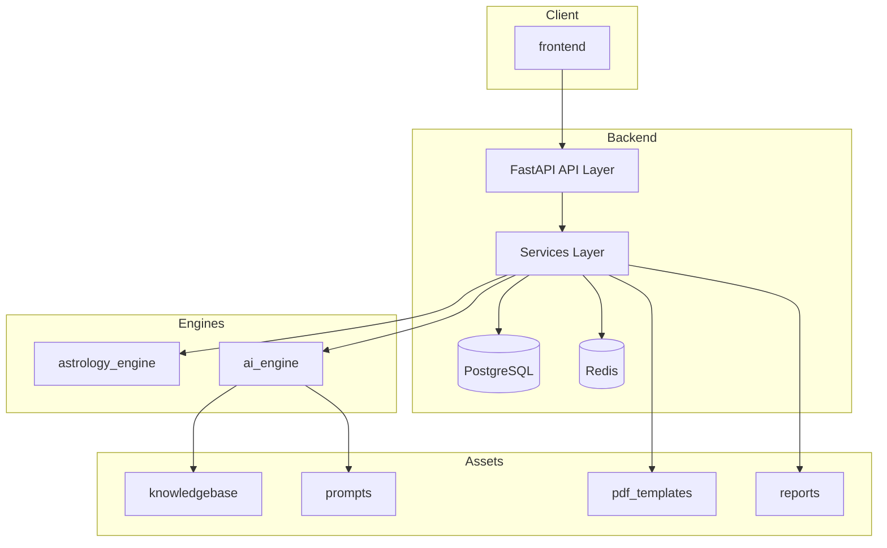

# AstroGuruAI

Production-grade astrology platform with a modular architecture separating deterministic chart computation from AI-powered interpretation.

## Tech Stack

| Layer | Technology |
|-------|------------|
| Runtime | Python 3.12 |
| API | FastAPI + Uvicorn |
| Database | PostgreSQL + SQLAlchemy (async) |
| Migrations | Alembic |
| Validation | Pydantic v2 |
| Cache | Redis (future-ready) |
| AI | Google Gemini API (future-ready) |

## Project Structure

```
AstroGuruAI/
├── backend/                 # FastAPI application, DB, API routes
│   ├── app/
│   │   ├── api/             # Route handlers & dependencies
│   │   ├── core/            # Config, logging, security
│   │   ├── db/              # SQLAlchemy session, Redis client
│   │   ├── models/          # ORM models
│   │   ├── schemas/         # Pydantic DTOs
│   │   ├── services/        # Orchestration layer
│   │   └── main.py          # Application entry point
│   └── alembic/             # Database migrations
├── astrology_engine/        # Pure astrology computation (no AI)
│   ├── core/                # Base types & abstract engine
│   └── interfaces/          # Public contracts
├── ai_engine/               # AI inference (no chart math)
│   ├── core/                # Base types & abstract engine
│   ├── interfaces/          # Public contracts
│   └── providers/           # Gemini & future LLM providers
├── frontend/                # Client app (placeholder)
├── knowledgebase/           # Static astrology reference data
├── reports/                 # Generated report output
├── pdf_templates/           # Report PDF/HTML templates
├── prompts/                 # AI prompt templates
├── tests/                   # Unit & integration tests
├── requirements.txt
├── pyproject.toml
└── .env.example
```

## Architecture



**Separation of concerns**

- `astrology_engine` — deterministic chart calculations; no network or AI dependencies.
- `ai_engine` — LLM inference and prompt orchestration; no ephemeris or chart math.
- `backend/app/services` — orchestrates engines, persistence, and API responses (to be implemented).

## Quick Start

### Prerequisites

- Python 3.12+
- PostgreSQL 15+ (optional for health check; required for DB features)
- Redis 7+ (optional; enable via `REDIS_ENABLED=true`)

### Setup

```bash
# Clone and enter project
cd AstroGuruAI

# Create virtual environment
python -m venv .venv

# Activate (Windows)
.venv\Scripts\activate

# Activate (macOS/Linux)
source .venv/bin/activate

# Install dependencies
pip install -r requirements.txt

# Configure environment
copy .env.example .env   # Windows
# cp .env.example .env   # macOS/Linux
```

### Run the API

```bash
uvicorn backend.app.main:app --reload --host 0.0.0.0 --port 8000
```

- API docs: http://localhost:8000/docs
- Health check: http://localhost:8000/api/v1/health

### Database Migrations

```bash
# From project root
alembic -c backend/alembic.ini revision --autogenerate -m "description"
alembic -c backend/alembic.ini upgrade head
```

### Run Tests

```bash
pytest
```

## Environment Configuration

All settings are loaded from environment variables (see `.env.example`). Key variables:

| Variable | Description | Default |
|----------|-------------|---------|
| `APP_ENV` | `development` \| `staging` \| `production` \| `test` | `development` |
| `DEBUG` | Enable debug mode | `false` |
| `DATABASE_URL` | PostgreSQL connection override | built from `POSTGRES_*` |
| `REDIS_ENABLED` | Enable Redis client | `false` |
| `GEMINI_ENABLED` | Enable Gemini provider | `false` |
| `GEMINI_API_KEY` | Google Gemini API key | — |
| `LOG_LEVEL` | Logging level | `INFO` |

Settings are centralized in `backend/app/core/config.py` using Pydantic Settings.

## Development Standards

- **Linting**: Ruff (`ruff check .`)
- **Type checking**: mypy (`mypy backend astrology_engine ai_engine`)
- **Testing**: pytest with async support
- **Imports**: Absolute imports from package roots (`backend`, `astrology_engine`, `ai_engine`)

## Status

This repository contains **architecture and starter files only**. Business logic for chart computation, AI interpretation, reports, and authentication is intentionally not implemented yet.

## License

Proprietary — All rights reserved.
