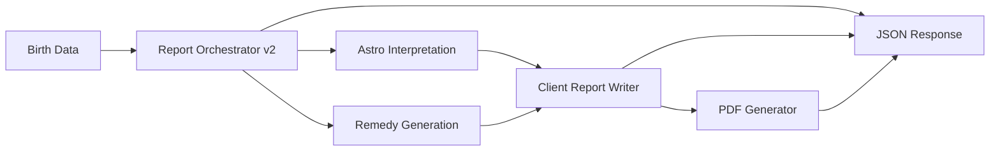

# AstroGuruAI Phase 3

Phase 3 adds Gemini integration, AI interpretation, remedy generation, client report writing, PDF export, horoscope engines, naming suggestions, and dashboard APIs.

## Modules

| Module | Path | Description |
|--------|------|-------------|
| Gemini Integration | `ai_engine/providers/gemini/` | API client, retry, rate limit, cost tracking, structured JSON |
| Prompts | `prompts/` | Template files for interpretation and remedy generation |
| Astro Interpretation | `ai_engine/interpreters/astro/` | Professional explanation JSON from unified report |
| Remedy Generation | `ai_engine/interpreters/remedy/` | Prioritized remedies across Vedic/LK/KP |
| Client Report Writer | `ai_engine/writers/client_report/` | 10-section client report JSON |
| PDF Generator | `reports/pdf/` | ReportLab PDF export |
| Horoscope Engine | `horoscope_engine/` | Daily, weekly, monthly horoscope JSON |
| Naming Engine | `naming_engine/` | Nakshatra/pada/rashi name suggestions |
| Dashboard APIs | `backend/app/api/v1/endpoints/dashboard.py` | Report, PDF, horoscope, naming endpoints |

## Environment

```env
GEMINI_ENABLED=true
GEMINI_API_KEY=your-key
GEMINI_MODEL=gemini-2.0-flash
GEMINI_MAX_RETRIES=3
GEMINI_RPM_LIMIT=30
REPORTS_OUTPUT_PATH=reports/output
```

When Gemini is disabled, interpretation and remedy generation use rule-based fallbacks.

## API Endpoints

Base prefix: `/api/v1/dashboard`

| Method | Path | Purpose |
|--------|------|---------|
| POST | `/reports/generate` | Full report pipeline (unified + interpretation + remedies + client report) |
| POST | `/reports/pdf` | Generate PDF from client report JSON |
| GET | `/reports/pdf/{file_name}` | Download generated PDF |
| POST | `/horoscope` | Daily, weekly, monthly horoscope |
| POST | `/naming/suggestions` | Name suggestions |

### Generate Report Example

```json
POST /api/v1/dashboard/reports/generate
{
  "date_of_birth": "1990-01-15",
  "birth_time": "05:00:00",
  "birth_place": "New Delhi, India",
  "timezone": "Asia/Kolkata",
  "latitude": "28.6139",
  "longitude": "77.2090",
  "problem_text": "Facing delay in marriage",
  "include_pdf": true
}
```

## Pipeline



## Testing

```bash
pip install -r requirements.txt
pytest tests/unit/test_phase3_engines.py -q
pytest tests/integration/test_dashboard_api.py -q
```

## Notes

- Gemini uses `google-generativeai` with JSON response mode when enabled.
- PDF files are written to `reports/output/` (configurable via `REPORTS_OUTPUT_PATH`).
- Chart computation still requires `pyswisseph` for live ephemeris-backed reports.
